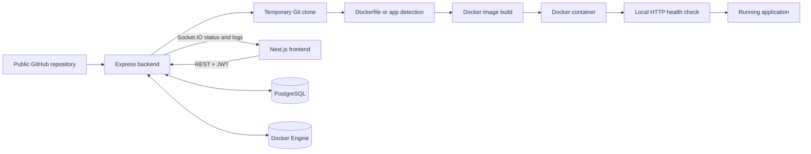

# DeployFlow

DeployFlow is a self-hosted deployment platform for GitHub applications.

It provides a focused, local-first workflow for turning a trusted public GitHub repository into a running Docker container. DeployFlow owns the clone, build, container lifecycle, health verification, deployment history, live events, and basic runtime visibility so those concerns do not have to be managed by hand for every test application.

> DeployFlow is a portfolio project, not a production-ready hosting platform. See [Security model](#security-model) and [Current limitations](#current-limitations) before running it.

## Key features

- Email/password authentication with signed JWT access tokens and operator-controlled registration.
- Per-user project management for public GitHub repositories, branches, container ports, and health-check paths.
- Deployment from an existing root `Dockerfile` without changing the repository.
- Conservative Dockerfile-free detection for supported npm-based Node.js applications and selected Flask, FastAPI, and Streamlit layouts.
- Docker image builds and container lifecycle management through Dockerode.
- Docker-assigned host ports bound to `127.0.0.1` for local application access.
- Health-gated deployments: a container is not marked `RUNNING` until its configured local HTTP path returns a `2xx` or `3xx` response.
- Live deployment status and real Docker build output over authenticated, deployment-scoped Socket.IO rooms.
- Current CPU usage, memory usage/limit, and uptime with five-second polling while a deployment is running.
- Stop, health-checked restart, redeploy, and deployment history.
- Safe replacement deployments: redeploy and rollback keep the current version running until its replacement is healthy.
- Rollback as a new deployment, reusing the historical image when available or rebuilding the exact stored commit otherwise.
- HMAC-verified GitHub push webhooks, branch/repository matching, and delivery-ID deduplication for automatic deployments.
- GitHub Actions CI for backend and frontend validation on pull requests and selected branches.

## Architecture



- **Frontend:** a Next.js App Router application for authentication, project configuration, deployment controls, live logs, history, webhook setup, and monitoring.
- **Backend:** an Express API that validates ownership and coordinates Git, application detection, Docker builds, containers, health checks, rollback, and replacement deployments.
- **PostgreSQL:** stores users, projects, deployments, rollback relationships, project-operation leases, and processed GitHub delivery IDs through Prisma.
- **Socket.IO:** authenticates with the same JWT identity as REST, authorizes each deployment subscription, and broadcasts only to that deployment's room.
- **Docker:** builds repository content, assigns a free loopback host port, runs applications, and supplies logs and runtime statistics.

The core deployment orchestration is kept in backend services. Docker, Git, health checks, and persistence remain independent of the HTTP and Socket.IO transport layers.

## Technology stack

| Area | Technologies |
| --- | --- |
| Frontend | Next.js, React, TypeScript, Tailwind CSS |
| Backend | Node.js, Express, TypeScript, Prisma, PostgreSQL, Socket.IO, Dockerode |
| Infrastructure | Docker, Git, GitHub Actions |
| Testing and quality | Vitest, Supertest, ESLint, TypeScript |

## Deployment lifecycle

The successful initial deployment flow is:

```text
QUEUED -> CLONING -> BUILDING -> STARTING -> HEALTHCHECKING -> RUNNING
```

- `FAILED` is a terminal state when preparation, build, startup, or health checking fails.
- `STOPPED` records a deployment whose container has been stopped; its history is retained.
- Restart passes through `STARTING -> HEALTHCHECKING -> RUNNING` and fails if the application does not become healthy.
- Redeploy creates a new record from the project's current repository and branch. Rollback also creates a new record from a selected successful deployment.
- During redeploy or rollback, the current `RUNNING` deployment stays available until the replacement reaches `RUNNING`. Only then is the previous container stopped and its record changed to `STOPPED`.

Docker assigns the host port dynamically. After startup, DeployFlow inspects the container, saves that port, and health-checks only `127.0.0.1:<hostPort>` using the project's application-relative path.

## Supported application detection

Detection follows a strict priority order:

1. **Dockerfile:** a regular root `Dockerfile` is used unchanged.
2. **Node.js:** a root `package.json` must be valid JSON and define a non-empty `scripts.start`. Generated images use Node 22, run `npm ci` when `package-lock.json` exists (otherwise `npm install`), optionally run `npm run build`, and start with `npm start`.
3. **Python:** a root `requirements.txt` or standard, pip-installable `pyproject.toml` must identify exactly one supported layout:
   - Flask with a root `app.py` and an `app` instance;
   - FastAPI with `fastapi` and `uvicorn`, plus a root `main.py` and `app` instance;
   - Streamlit with a root `app.py`.
4. Anything else returns `Unsupported application type` rather than guessing a command.

Generated Dockerfiles exist only inside the temporary clone. npm and pip installation, application build scripts, and launch commands run inside Docker—not directly on the DeployFlow host.

## Screenshots

### Dashboard

<!-- Add the DeployFlow dashboard screenshot here. -->

_Screenshot placeholder: project cards, latest deployment state, and project creation._

### Project details

<!-- Add the project details screenshot here. -->

_Screenshot placeholder: repository configuration, deployment state, and lifecycle actions._

### Live build logs

<!-- Add the live build log screenshot here. -->

_Screenshot placeholder: authenticated Socket.IO connection and real Docker build events._

### Runtime monitoring

<!-- Add the runtime monitoring screenshot here. -->

_Screenshot placeholder: container state, CPU, memory, and uptime._

### Deployment history

<!-- Add the deployment history screenshot here. -->

_Screenshot placeholder: deployment records, application types, timestamps, and rollback controls._

## Local installation

### Prerequisites

- Node.js 20 or newer and npm.
- Git.
- Docker Desktop on Windows/macOS, or Docker Engine on Linux. The current user must be able to access the Docker daemon.
- PostgreSQL, either installed locally or running in Docker.

### 1. Clone the repository

```powershell
git clone <your-deployflow-repository-url>
cd DeployFlow
```

The equivalent `git clone` and `cd` commands work in Bash or another shell.

### 2. Start PostgreSQL

If PostgreSQL is not already available, this local-only Docker example creates a database matching the sample connection string:

```powershell
docker run --name deployflow-postgres -e POSTGRES_USER=deployflow -e POSTGRES_PASSWORD=deployflow_dev -e POSTGRES_DB=deployflow -p 127.0.0.1:5432:5432 -d postgres:17-alpine
```

The credentials above are development examples. Choose different credentials for any non-local environment and update `DATABASE_URL` accordingly.

### 3. Configure and install the backend

Windows PowerShell:

```powershell
cd backend
Copy-Item .env.example .env
```

Bash:

```bash
cd backend
cp .env.example .env
```

Edit `backend/.env` before installing. At minimum, set the PostgreSQL connection and replace both secret placeholders with independent random values. For example, PowerShell can generate a 32-byte secret with:

```powershell
[Convert]::ToBase64String([Security.Cryptography.RandomNumberGenerator]::GetBytes(32))
```

Then install dependencies and prepare the database:

```powershell
npm ci
npm run prisma:validate
npm run prisma:generate
npm run prisma:migrate:deploy
```

`prisma:migrate:deploy` applies the migrations already committed to the repository without resetting existing data.

### 4. Configure and install the frontend

From the repository root, in a separate terminal:

Windows PowerShell:

```powershell
cd frontend
npm ci
Copy-Item .env.example .env.local
```

Bash:

```bash
cd frontend
npm ci
cp .env.example .env.local
```

The sample frontend values work when the backend uses its default local address.

### 5. Start DeployFlow

Backend terminal:

```powershell
cd backend
npm run dev
```

Frontend terminal:

```powershell
cd frontend
npm run dev
```

Open [http://localhost:3000](http://localhost:3000). The backend health endpoint is [http://localhost:4000/api/health](http://localhost:4000/api/health).

Registration is disabled by default. To create the first account, temporarily set `REGISTRATION_ENABLED=true`, restart the backend, register, then restore it to `false` and restart again. Existing users can still sign in while registration is disabled.

## Environment variables

Never commit `backend/.env` or `frontend/.env.local`. Both are ignored by the repository's Git configuration; use the checked-in example files as templates.

### Backend (`backend/.env`)

| Variable | Purpose | Example/default behavior |
| --- | --- | --- |
| `NODE_ENV` | Runtime mode | `development`, `test`, or `production` |
| `PORT` | Backend HTTP and Socket.IO port | `4000` |
| `BIND_HOST` | Backend bind address | `127.0.0.1` |
| `DATABASE_URL` | PostgreSQL connection string used by Prisma | Local PostgreSQL URL; replace the sample password |
| `JWT_SECRET` | HMAC key for access tokens | Required, random, and at least 32 bytes |
| `JWT_EXPIRES_IN` | Access-token lifetime understood by `jose` | `1h` |
| `REGISTRATION_ENABLED` | Enables or disables new account registration | `false` |
| `GITHUB_WEBHOOK_SECRET_KEY` | Master key used to derive a stable per-project webhook secret | Independent random value of at least 32 bytes; webhooks are unavailable when omitted |
| `PUBLIC_BASE_URL` | Public backend origin used to form webhook payload URLs | `http://localhost:4000`; use an HTTPS tunnel origin for real GitHub delivery |

### Frontend (`frontend/.env.local`)

| Variable | Purpose | Local value |
| --- | --- | --- |
| `BACKEND_API_URL` | Server-side target for the `/backend-api/*` rewrite | `http://localhost:4000` |
| `NEXT_PUBLIC_SOCKET_URL` | Browser-visible Socket.IO backend origin | `http://localhost:4000` |

For webhook setup and secure-tunnel instructions, see [GitHub auto-deploy configuration](docs/github-auto-deploy.md).

## Testing and quality checks

Run backend checks from `backend/`:

```powershell
npm run prisma:generate
npm run prisma:validate
npm run typecheck
npm run lint
npm test
npm run build
```

Run frontend checks from `frontend/`:

```powershell
npm run typecheck
npm run lint
npm run build
```

The backend Vitest suite covers authentication, ownership boundaries, Git preparation, application detection, Docker build/container behavior, orchestration and cleanup, health checks, deployment routes, rollback/redeploy cutover rules, webhooks, and Socket.IO authorization using mocked infrastructure boundaries. The frontend currently has lint, strict TypeScript, and production-build checks; no frontend test runner is configured.

The [GitHub Actions workflow](.github/workflows/ci.yml) runs the equivalent backend and frontend checks on pull requests and pushes to `main` or `stretch-features`. It uses test-only environment values and does not deploy DeployFlow.

## Example deployment

The small public [crccheck/docker-hello-world](https://github.com/crccheck/docker-hello-world) repository is useful for a local Docker smoke test:

| Project setting | Value |
| --- | --- |
| Repository | `https://github.com/crccheck/docker-hello-world` |
| Branch | `master` |
| Container port | `8000` |
| Health-check path | `/` |

Create a project with those values, select **Deploy**, wait for `RUNNING`, and use **Open Application**. Docker chooses the host port; the test application should respond over HTTP with “Hello World.”

## GitHub webhook auto-deploy

Each project details page exposes an owner-only payload URL and derived webhook secret. Configure that URL in the matching GitHub repository, select `application/json`, paste the secret, and enable only push events. DeployFlow verifies GitHub's SHA-256 HMAC signature, repository, configured branch, and delivery ID before creating a new replacement deployment.

A local backend is not reachable by GitHub directly. For manual testing, set `PUBLIC_BASE_URL` to the origin of a secure HTTPS tunnel that forwards to the backend. Follow the complete [GitHub webhook guide](docs/github-auto-deploy.md).

## Security model

**DeployFlow currently assumes deployment repositories are trusted. It is not designed to safely execute arbitrary untrusted public code.**

Repository code is cloned, built, and run by the local Docker daemon. Docker daemon access is highly privileged: a process with control of that daemon can effectively control workloads and may be able to compromise the host. Keep the backend private, protect its environment files, restrict access to the Docker socket, and deploy only repositories reviewed by the operator.

The current implementation limits repository URLs to public GitHub HTTPS URLs, invokes Git with argument arrays, binds application ports to loopback, validates health paths, scopes REST and Socket.IO access through project ownership, verifies webhook HMAC signatures, and cleans temporary/runtime resources on expected failure paths. These safeguards do not turn Docker into a hardened multi-tenant sandbox.

## Current limitations

- Self-hosted and local-first; the backend and deployed application ports bind to loopback by default.
- Public GitHub HTTPS repositories only; private repository credentials are not supported.
- Deployment repositories must be trusted by the operator.
- Automatic detection is intentionally narrow: npm projects with a start script and specific root-level Flask, FastAPI, or Streamlit layouts.
- The configured Node application must honor conventional `HOST` and `PORT` environment variables; custom startup layouts may need their own Dockerfile.
- One Docker host and one backend process; there is no distributed queue, multi-host scheduler, or high-availability coordination.
- No Kubernetes, autoscaling, custom-domain routing, managed TLS, or built-in reverse proxy.
- No production-grade sandboxing, container CPU/memory limits, network isolation policy, image scanning, or build quotas.
- Live deployment events are not persisted or replayed. The logs panel receives only events emitted after it subscribes, although container logs can be retrieved through the API.
- Runtime monitoring exposes current Docker statistics only; it does not store historical metrics.
- Health checks support a local `GET` path with fixed retry behavior, not custom headers, methods, or response-body assertions.

## Future improvements

- Resource limits, build timeouts, network controls, and more robust Docker cleanup reconciliation.
- A durable job queue and worker model for deployments and webhook processing.
- Persisted build logs and historical metrics.
- Private GitHub repository authentication with narrowly scoped credentials.
- Reverse-proxy routing, custom domains, and TLS management.
- Configurable health-check timing and richer readiness rules while preserving local-only targets.
- Frontend component and browser-level automated tests.

## Engineering highlights

Building DeployFlow provided practical experience with:

- Orchestrating multi-stage deployments across Git, Prisma, Docker builds, containers, and HTTP health checks.
- Managing partial failures and cleanup without taking a healthy previous deployment offline.
- Preserving immutable deployment history across redeploy and rollback workflows.
- Streaming scoped real-time events while enforcing the same ownership boundary as REST.
- Calculating and presenting live Docker CPU, memory, and uptime data.
- Designing around privileged Docker access, trusted-code assumptions, webhook verification, input validation, and bounded health checks.
- Testing service boundaries and lifecycle transitions with deterministic mocks, plus validating both applications in CI.

For the complete product scope and explicit assumptions, see [SPEC.md](SPEC.md).
